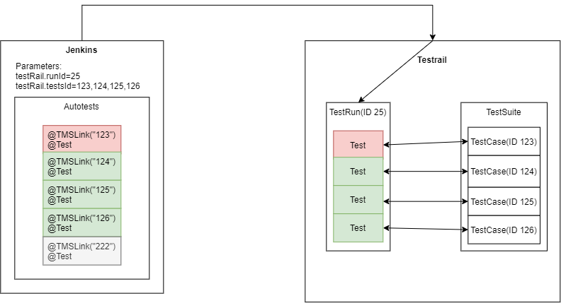

### Взаимодействие с репозиторием:

Ветка Master - основная ветка с полностью готовым и стабильно работающим кодом

Ветка %username%* - ветка, над которой в данный момент работает отдельно взятый человек

(* ветка именуется по корпоративному логину сотрудника, например - ветка al.golofeev)

**1 -**  Разработка задач производится в своих ветках 

**2 -**  Перед началом работы необходимо переключиться на ветку master и получить ее последнюю версию, после чего применить все изменения к своей ветке

- Переключиться в ветку master, сделать git pull
- Переключиться в ветку %username% и сделать merge into current с master
- Работать

**3 -** После реализации задачи в своей ветке и перед тем, как сделать git push, необходимо еще раз обновить свою ветку с master

- Сделать git commit своих изменений 
- Переключиться в ветку master, сделать git pull
- Переключиться в ветку %username% и сделать merge into current с master (если при мерже вылазят разные непонятные окошки - читаем, что там написано, а не клацаем OK, OK, OK)
- Git Push

**4 -** Если всё ок, и задача (на Ваш взгляд) реализована корректно - делаем Pull Request из своей ветки в master

### Requires

Maven 3.3.6 or higher

Java 8

Lombok plugin for Intellij IDEA

### Integration with TestRail

(On the diagram below test with TestCase ID 222 is skipped by test framework)

